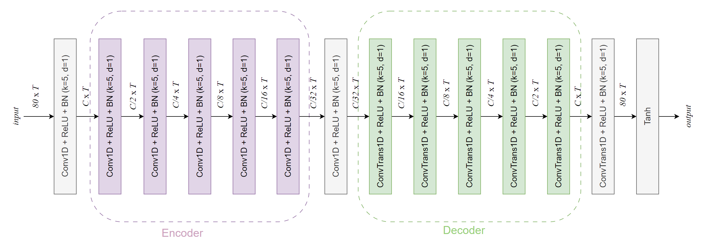
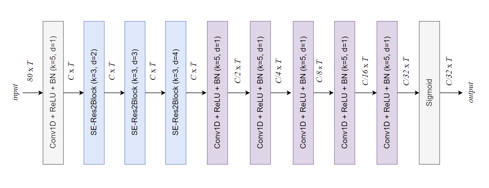
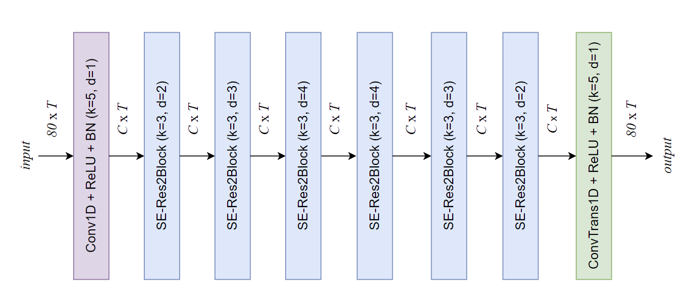

# Initiative Defense against Voice Conversion through Generative Adversarial Network

This is the official implementation of the paper Initiative Defense against Voice Conversion through Generative
Adversarial Network.

## The intention of our work

The left part of the figure represents the normal voice conversion process, while the right part illustrates the intention of our work. We introduce perturbations to the mel spectrogram of the target audio to prevent the voice conversion model from generating the intended output.

## The architectural detail of the our work

The SE-ResNet blocks were proposed by ECAPA-TDNN, and the details of the SE-ResNet blocks can be found in the original paper [here](https://arxiv.org/abs/2005.07143).

In the architectural detail graph below, "Conv1D + ReLU + BN" represents a 1D convolutional block consisting of 1D convolutional layers, a ReLU activation function, and batch normalization. "ConvTrans1D" denotes a 1D transposed convolution layer. "k" indicates the kernel size, "d" represents the dilation, "C" signifies the channel size, and "T" denotes the relative time length of the input mel-spectrogram.

### Generator

### Discriminator

### SWCSM

## VC Models

1. Adain-vc: https://github.com/cyhuang-tw/AdaIN-VC
2. Vqvc+: https://github.com/ericwudayi/SkipVQVC
3. Again-vc: https://github.com/KimythAnly/AGAIN-VC
4. Triaan-vc: https://github.com/winddori2002/TriAAN-VC

## Conda env creation

Use `conda env create -f cc.yaml` to create conda env.

## Vocoder && data preprocessing

Melgan: https://github.com/descriptinc/melgan-neurips

## Speaker verification

Resemblyzer: https://github.com/resemble-ai/Resemblyzer

## Dataset

- VCTK: https://datashare.ed.ac.uk/handle/10283/2950.
- Experimental samples can be found in the 'samples' folder under this repository.

## checkpoints

The `checkpoints/netG` folder contains the weights of the generator, and `checkpoints/swcsm` contains the weights of the swcsm.

## Training

### Hyper-parameter

hyper-parameter settings are all in the file hyperparameter.py. You can adjust them according to the specific needs.

### Training

#### Setup hyperparameter.py

1. Set the field `self.project_root` to the path of this repository. For steps 2-7, you can place all the data under the `data` folder within this repository.
2. Set the feild self.vctk_48k to the path of the VCTK dataset. e.g. `/you/path/to/the/VCTK-Corpus-0.92/wav48_silence_trimmed`, or put it under the `data` folder of this repo.
3. Set the feild self.vctk_22k to the path where you want to place resampled waveform.
4. Set the feild self.vctk_mels to the path where you want to store the processed mel.
5. Set the feild self.vctk_speaker_info to the path of the VCTK speaker-info.txt file.
6. Set the feild self.metadata to the path where you place metadata.json.
7. Set the feild self.vctk_rec_mels to the path where you want to place vctk_rec_mels which are mels that reconstruct to
   the waveform and re-extract with melgan preprocessing.

#### Preprocessing

1. Run prepare_data.py to 1) downsample the VCTK dataset, 2) extract from the VCTK dataset, and 3) obtain the metadata.

#### Train SWCSM

1. Run train_swcsm.py to train the swcsm.

#### Train Framework

1. Run trainer.py to train the framework.

## Acknowledge

Our implementation is hugely influenced by the repositories metioned before and the following repositories as we benefit
a lot from their codes and papers.

- https://github.com/mathcbc/advGAN_pytorch
- https://github.com/cyhuang-tw/attack-vc
